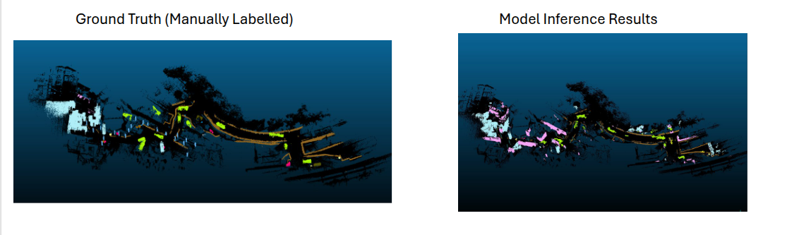
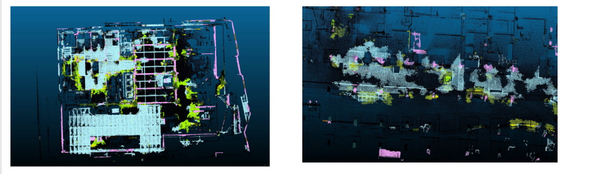
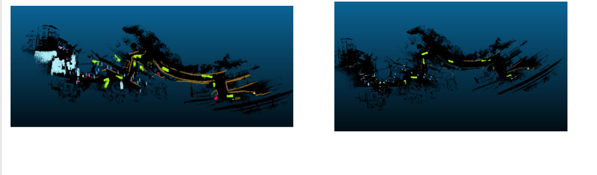
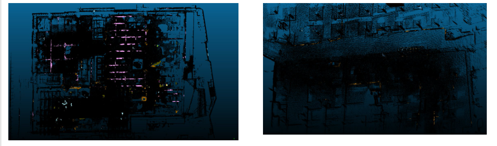
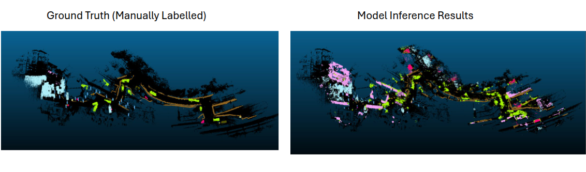
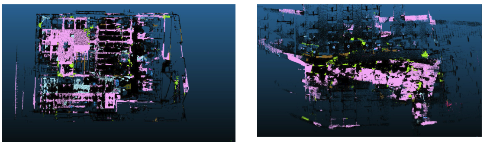

# Model Training README

This document continues from [`dataset_prep_readme.md`](dataset_prep_readme.md).
Use it after your dataset has already been labeled and converted into either:

- SemanticKITTI-style sequences for `KPConv` and `RandLA-Net`
- S3DIS-style `Area_*` folders for `PointTransformer`

The commands below are based on the training and testing workflow in [`dataset_scripts/README_Final.txt`](dataset_scripts/README_Final.txt), but they are written against the files that are currently versioned in this repository.

## Before you start

1. Finish the environment setup in [`README.md`](README.md).
2. Finish the dataset conversion steps in [`dataset_prep_readme.md`](dataset_prep_readme.md).
3. Confirm that the modified YAML files from [`configs/`](configs) have already been copied into your `Open3D-ML/ml3d/configs/` folder.
4. Activate the conda environment:

```bash
conda activate o3dml_cuda128
```

Set the paths for your machine before running the commands below:

```bash
PROJECT_ROOT=/path/to/Semantic-Segmentation-Driven-Robot-Inclusivity--Evaluating-Construction-Site-Accessibility-from-3D-Point-Clouds
OPEN3D_ML_ROOT=/path/to/Open3D-ML
SEMKITTI_DATASET_ROOT=/path/to/Training
S3DIS_DATASET_ROOT=/path/to/Training/dataset_s3dis/Stanford3dDataset_v1.2_Aligned_Version
```

## Dataset Size Summary

This workflow uses a combined dataset made up of real-world and synthetic point clouds.
The dataset summary is:

| Dataset Type | No. of Point Clouds | No. of Points | Overall Percentage |
| --- | ---: | ---: | ---: |
| Real World | 14 | 37,352,003 | 82.34% |
| Synthetic | 10 | 8,005,974 | 17.66% |
| Total | 24 | 45,357,977 | 100% |

After oversampling, the training dataset contains `68,535,242` points.

## Model Performance Summary

The quantitative performance summary for the three models in this workflow is:

| Model | Best Epoch | Training IoU | Training Accuracy | Validation IoU | Validation Accuracy |
| --- | ---: | ---: | ---: | ---: | ---: |
| RandLA-Net | 250 | 0.6220 | 67.65% | 0.2657 | 36.35% |
| KPConv | 399 | 0.7331 | 77.4% | 0.2509 | 37.89% |
| PointTransformer | 185 | 0.5448 | 79.83% | 0.2081 | 38.78% |

## Qualitative Inference Summary

| Model | Training Set Inference | Generalization Inference |
| --- | --- | --- |
| RandLA-Net | Performs well on trained-set inference. | Difficult to generalize and prone to misclassification. |
| KPConv | Segments points more precisely but is prone to under-classification. | Captures classes with good precision but remains prone to under-classification. |
| PointTransformer | Correctly segments a larger number of points but still exhibits some misclassifications. | Demonstrates the strongest overall inference performance, detecting multiple classes accurately with minor misclassifications. |

## Important note about raw inference

For raw, unseen SemanticKITTI-style scans, use `--split predict`.
Do not use `--split test` on raw scans that do not have ground-truth `.label` files.

In this project, that raw prediction workflow is project-specific:

- [`open3d_modified_scripts/run_pipeline.py`](open3d_modified_scripts/run_pipeline.py) adds `--split predict`, `--predict_seq`, and the dedicated raw-sequence prediction branch.
- [`open3d_modified_scripts/semantic_segmentation.py`](open3d_modified_scripts/semantic_segmentation.py) guards metric logging in `run_test()` when no ground-truth labels are available.
- [`open3d_modified_scripts/semantickitti.py`](open3d_modified_scripts/semantickitti.py) returns zero labels when `.label` files are missing on the `test` split.
- The custom `predict` branch also injects dummy zero labels before calling `run_inference()`, so inference can run without trying to evaluate accuracy on unlabeled raw scans.

## Monitoring workflow

The original workflow in `README_Final.txt` used four terminals. That is still a practical setup:

- Terminal 1: training or testing command
- Terminal 2: TensorBoard or a second training run
- Terminal 3: `watch nvidia-smi`
- Terminal 4: `htop`

Monitoring commands:

```bash
watch nvidia-smi
htop
```

## Option A. Train SemanticKITTI models

Use this path when your prepared dataset contains `sequences/<seq>/velodyne` and `sequences/<seq>/labels`.

### A1. Train RandLA-Net

```bash
cd "$OPEN3D_ML_ROOT"
python scripts/run_pipeline.py torch \
  -c ml3d/configs/randlanet_semantickitti.yml \
  --dataset.dataset_path "$SEMKITTI_DATASET_ROOT" \
  --pipeline SemanticSegmentation \
  --dataset.use_cache True \
  --device cuda \
  --device_ids 0
```

### A2. Train KPConv

```bash
cd "$OPEN3D_ML_ROOT"
python scripts/run_pipeline.py torch \
  -c ml3d/configs/kpconv_semantickitti.yml \
  --dataset.dataset_path "$SEMKITTI_DATASET_ROOT" \
  --pipeline SemanticSegmentation \
  --dataset.use_cache True \
  --device cuda \
  --device_ids 0
```

Legacy note:

- `README_Final.txt` also mentions a multi-process `launch_train.py` workflow.
- That helper is not documented in this repository, so `scripts/run_pipeline.py` is the supported command here.

### A3. Monitor with TensorBoard

Use the actual log directory created by your run under `train_log/`.

Examples:

```bash
cd "$OPEN3D_ML_ROOT"
tensorboard --logdir "$OPEN3D_ML_ROOT/train_log/00001_KPFCNN_SemanticKITTI_torch" --port 6006
tensorboard --logdir "$OPEN3D_ML_ROOT/train_log/00001_RandLANet_SemanticKITTI_torch" --port 6006
```

### A4. Test on the prepared test split

RandLA-Net:

```bash
cd "$OPEN3D_ML_ROOT"
python scripts/run_pipeline.py torch \
  -c ml3d/configs/randlanet_semantickitti.yml \
  --split test \
  --dataset.dataset_path "$SEMKITTI_DATASET_ROOT" \
  --pipeline SemanticSegmentation \
  --dataset.use_cache True \
  --device cuda \
  --device_ids 0
```

KPConv:

```bash
cd "$OPEN3D_ML_ROOT"
python scripts/run_pipeline.py torch \
  -c ml3d/configs/kpconv_semantickitti.yml \
  --split test \
  --dataset.dataset_path "$SEMKITTI_DATASET_ROOT" \
  --pipeline SemanticSegmentation \
  --dataset.use_cache True \
  --device cuda \
  --device_ids 0
```

Example test outputs for the SemanticKITTI-style models:

RandLA-Net training-set inference example:



RandLA-Net generalization example:



KPConv training-set inference example:



KPConv generalization example:



### A5. Predict on a raw unseen sequence

Use `--split predict` for raw unseen SemanticKITTI-style scans that do not have ground-truth `.label` files.

Do not use `--split test` for that case.
The custom `predict` CLI path is added in [`open3d_modified_scripts/run_pipeline.py`](open3d_modified_scripts/run_pipeline.py), not in `semantic_segmentation.py` alone.
That patched workflow reads raw `.bin` scans from `dataset/sequences/<seq>/velodyne`, injects dummy zero labels, runs inference, and saves predictions without requiring accuracy or IoU computation against missing ground truth.

Set `--ckpt_path` to the checkpoint you want to use and `--predict_seq` to the sequence name you want to predict.

RandLA-Net:

```bash
cd "$OPEN3D_ML_ROOT"
python scripts/run_pipeline.py torch \
  -c ml3d/configs/randlanet_semantickitti.yml \
  --split predict \
  --ckpt_path /path/to/RandLANet/checkpoint/ckpt_xxxxx.pth \
  --dataset.dataset_path "$SEMKITTI_DATASET_ROOT" \
  --predict_seq testfullpcd \
  --device cuda \
  --device_ids 0
```

KPConv:

```bash
cd "$OPEN3D_ML_ROOT"
python scripts/run_pipeline.py torch \
  -c ml3d/configs/kpconv_semantickitti.yml \
  --split predict \
  --ckpt_path /path/to/KPFCNN/checkpoint/ckpt_xxxxx.pth \
  --dataset.dataset_path "$SEMKITTI_DATASET_ROOT" \
  --predict_seq testfullpcd \
  --device cuda \
  --device_ids 0
```

### A6. Export SemanticKITTI predictions back to `.ply`

[`export_predicted_ply_FINAL.py`](dataset_scripts/export_predicted_ply_FINAL.py) is still configuration-driven.
Edit the path block at the top of the script first, then run:

```bash
conda activate o3dml_cuda128
python "$PROJECT_ROOT/dataset_scripts/export_predicted_ply_FINAL.py"
```

Use this after `RandLA-Net` or `KPConv` prediction so you can inspect the result in CloudCompare.
Open the exported predicted `.ply` file in CloudCompare to review the semantic labels and compare them against the expected scene structure.

## Option B. Train S3DIS / PointTransformer

Use this path when your prepared dataset contains `Stanford3dDataset_v1.2_Aligned_Version/Area_*`.

### B1. Train PointTransformer

```bash
cd "$OPEN3D_ML_ROOT"
python scripts/run_pipeline.py torch \
  -c ml3d/configs/pointtransformer_s3dis.yml \
  --dataset.dataset_path "$S3DIS_DATASET_ROOT" \
  --device cuda
```

### B2. Monitor with TensorBoard

```bash
cd "$OPEN3D_ML_ROOT"
tensorboard --logdir "$OPEN3D_ML_ROOT/train_log/00001_PointTransformer_S3DIS_torch" --port 6006
```

### B3. Test on an S3DIS test area

For PointTransformer, this `--split test` command is also the inference command after a raw cloud has already been converted into S3DIS-style `Area_* / room_*` chunks.
Do not try to run one full construction-site cloud directly through the model.
Transformer inference is VRAM-heavy, and full-cloud inference can cause the GPU to run out of memory.

The legacy workflow used `test_area_idx=3`.
Adjust it to match the area you reserved during dataset preparation.

Recommended memory-conservative command from `README_Final.txt`:

```bash
cd "$OPEN3D_ML_ROOT"
PYTORCH_CUDA_ALLOC_CONF=expandable_segments:True,max_split_size_mb:128 \
python -u scripts/run_pipeline.py torch \
  -c ml3d/configs/pointtransformer_s3dis.yml \
  --split test \
  --ckpt_path /path/to/PointTransformer/checkpoint/ckpt_xxxxx.pth \
  --dataset.dataset_path "$S3DIS_DATASET_ROOT" \
  --dataset.test_area_idx 3 \
  --dataset.num_points 8192 \
  --model.voxel_size 0.16 \
  --pipeline.test_batch_size 1 \
  --device cuda
```

Optional log monitoring:

```bash
cd "$OPEN3D_ML_ROOT"
tail -f logs/PointTransformer_S3DIS_torch/log_test_*.txt
```

Example test outputs for PointTransformer:

PointTransformer training-set inference example:



PointTransformer generalization example:



### B4. Prepare raw `.ply` clouds for PointTransformer inference

For raw PointTransformer inference, you must first split the point cloud into S3DIS-style `Area_* / room_*` chunks before running the model.

This chunking step is necessary.
Transformer inference on a full construction-site point cloud can require too much VRAM and cause the GPU to run out of memory.
In this project, the correct inference flow is:

1. split the raw `.ply` cloud into `Area_* / room_*` chunks
2. run the `PointTransformer` `--split test` command from B3 on that generated test area
3. merge the chunk predictions back together with `merge_split_predictions_s3dis.py`
4. convert the merged output back to `.ply`

The legacy workflow used a `convert_ply_to_s3dis.py` helper before running `PointTransformer` testing on custom test clouds.
That helper is referenced in `README_Final.txt`, but it is not included in this repository.

If you already maintain your own copy of that converter, the legacy example was:

```bash
python convert_ply_to_s3dis.py \
  --input /path/to/testset/ \
  --dataset-path "$S3DIS_DATASET_ROOT" \
  --test-area 3
```

After conversion, run the `PointTransformer` test command from B3, then continue with B5 and B6.

### B5. Merge split predictions after testing

```bash
python "$PROJECT_ROOT/dataset_scripts/merge_split_predictions_s3dis.py" \
  --pred-dir "$OPEN3D_ML_ROOT/test/S3DIS" \
  --meta-dir "$S3DIS_DATASET_ROOT/original_pkl_meta" \
  --out-dir "$OPEN3D_ML_ROOT/test/S3DIS/merged"
```

This merges chunk-level `.npy` predictions back into one `.npy` per original point cloud.

### B6. Convert merged PointTransformer predictions back to `.ply`

```bash
python "$PROJECT_ROOT/dataset_scripts/npy_to_ply_s3dis.py" \
  --pred-dir "$OPEN3D_ML_ROOT/test/S3DIS/merged" \
  --dataset-path "$S3DIS_DATASET_ROOT" \
  --out-dir /path/to/predicted_ply_merged
```

After conversion, open the predicted `.ply` output in CloudCompare to inspect the inference result and verify how well the segmentation generalizes to the target scene.

### B7. Optional fine-tuning of PointTransformer class weights

These commands come from the legacy workflow.
Use them only after you have already trained once and want to adjust the effective CE weighting.

```bash
python "$PROJECT_ROOT/dataset_scripts/finetune_weights_pointtransformer.py" \
  --config "$OPEN3D_ML_ROOT/ml3d/configs/pointtransformer_s3dis.yml" \
  --mode ce \
  --ce-power 1.0 \
  --ce-mult "12:0.85,1:1.08,4:1.03,0:0.95"

python "$PROJECT_ROOT/dataset_scripts/finetune_weights_pointtransformer.py" \
  --config "$OPEN3D_ML_ROOT/ml3d/configs/pointtransformer_s3dis.yml" \
  --mode ce \
  --ce-power 1.0 \
  --ce-mult "1:1.05,7:0.97"

python "$PROJECT_ROOT/dataset_scripts/finetune_weights_pointtransformer.py" \
  --config "$OPEN3D_ML_ROOT/ml3d/configs/pointtransformer_s3dis.yml" \
  --mode ce \
  --ce-power 0.95 \
  --ce-mult "11:0.995,7:0.995,10:1.02"
```

The script does not edit YAML for you.
It prints a new `class_weights` line that you then paste into `ml3d/configs/pointtransformer_s3dis.yml`.

## Expected outputs

For SemanticKITTI models:

- checkpoints under `logs/` or `train_log/`
- prediction `.label` files for the requested sequence
- `.ply` exports from `export_predicted_ply_FINAL.py`

For PointTransformer:

- checkpoints under `logs/PointTransformer_S3DIS_torch/`
- chunk prediction `.npy` files under `test/S3DIS/`
- merged `.npy` files after `merge_split_predictions_s3dis.py`
- `.ply` files after `npy_to_ply_s3dis.py`

## Related files

- Device / environment setup: [`README.md`](README.md)
- Dataset preparation: [`dataset_prep_readme.md`](dataset_prep_readme.md)
- Legacy training note: [`dataset_scripts/README_Final.txt`](dataset_scripts/README_Final.txt)
