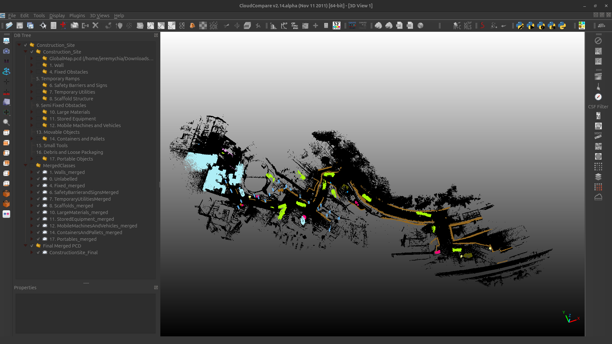

# Dataset Preparation README

This document explains how to prepare datasets for this project using the scripts in [`dataset_scripts/`](dataset_scripts).

It covers:

- manual labeling in CloudCompare
- conversion from labeled `.ply` files into training-ready dataset layouts
- SemanticKITTI-style preprocessing for `KPConv` and `RandLA-Net`
- S3DIS-style preprocessing for `PointTransformer`
- class-weight computation
- exporting predictions back to `.ply`

## Before you start

Most scripts in `dataset_scripts` are configuration-driven.
That means you must open each script and edit the path and parameter block near the top before running it.

Common values you will need to adjust:

- input data folder
- output dataset folder
- grid cell size
- train / validation split bands
- training sequence names
- class mappings

Also note:

- The older notes in `dataset_scripts/README_Final.txt` mention some scripts that are not present in this repository anymore.
- This README only documents the scripts that are actually present in `dataset_scripts`.
- The old notes also mention `ply_to_semantic.py`, but that file is not in this repository. In this project workflow, you can start labeling directly from `.pcd` in CloudCompare, but the final labeled output must still be exported as `.ply` before running the dataset conversion scripts.

## Stage 1. Label the dataset in CloudCompare

Labeling is the first stage.
Create the semantic labels in CloudCompare before running any of the dataset conversion scripts.

### Install CloudCompare

Use the official CloudCompare downloads page:

- Windows: https://www.cloudcompare.org/release/
- Ubuntu: https://www.cloudcompare.org/release/

Instructions:

1. Open the official CloudCompare release page.
2. Download the latest stable release, not a beta build.
3. On Windows, use the latest stable Windows installer from the official page.
4. On Ubuntu, use the latest stable Linux build referenced on the same official page. The official project also provides Linux packages through Flathub.
5. Use the latest stable release on both Windows and Ubuntu for better stability and fewer installation issues.

Example Ubuntu commands if you use the official Flathub package:

```bash
flatpak install flathub org.cloudcompare.CloudCompare
flatpak run org.cloudcompare.CloudCompare
```

### Labeling workflow

Use the following CloudCompare workflow for semantic labeling:

1. Open your source cloud `.pcd` file in CloudCompare.
2. Perform your labeling work and save draft CloudCompare project files as `.bin` files while you work.
3. Create or import the semantic label color scale through `Edit > Color Scales Manager`.
4. Create groups for the semantic classes by right-clicking in the stage tree on the left panel. Example: `0. Unlabelled`.
5. Segment the point cloud using the segment tool, rename the segmented portion, and drag it into the correct class group.
6. After placing segmented objects into their class groups, assign a scalar field to each segmented object through `Edit > Scalar Fields > Add Constant SF`.
7. After all semantic labels have been assigned as scalar fields, merge all objects inside each class group and place them into a `MergedClasses` group.
8. Lastly, merge all merged class point clouds into one final merged point cloud and save that final output as a `.ply` mesh file.

Use the project-tree layout in your reference screenshot as the target structure for the CloudCompare project:

- class folders on the left panel
- a `MergedClasses` folder containing the merged class clouds
- one final merged point cloud at the end

Example CloudCompare project layout:



This repository already includes [`dataset_scripts/color_scale.xml`](dataset_scripts/color_scale.xml), which you can reuse as the base CloudCompare color scale if it matches your label set.

Recommended output from the labeling stage:

- one final labeled `.ply` file per scene or capture
- draft CloudCompare `.bin` project files
- a saved CloudCompare XML color scale for the label scheme you used

## Stage 2. Choose the target dataset format

There are two dataset-preparation paths in this repository.

### Path A: SemanticKITTI-style output

Use this path for:

- `KPConv`
- `RandLA-Net`

These scripts write:

- `sequences/<seq>/velodyne/*.bin`
- `sequences/<seq>/labels/*.label`

Main scripts:

- [`recommended_spatial_split_params.py`](dataset_scripts/recommended_spatial_split_params.py)
- [`spatial_grid_splitting.py`](dataset_scripts/spatial_grid_splitting.py)
- [`compute_weights_ver4.py`](dataset_scripts/compute_weights_ver4.py)
- [`check_label2.py`](dataset_scripts/check_label2.py)
- [`export_predicted_ply_FINAL.py`](dataset_scripts/export_predicted_ply_FINAL.py)

### Path B: S3DIS-style output

Use this path for:

- `PointTransformer`

These scripts write:

- `Stanford3dDataset_v1.2_Aligned_Version/Area_*/room_*/Annotations/*.txt`

Main scripts:

- [`spatial_grid_splitting_s3dis.py`](dataset_scripts/spatial_grid_splitting_s3dis.py)
- [`oversampled_s3dis.py`](dataset_scripts/oversampled_s3dis.py)
- [`compute_weights_pointtransformer.py`](dataset_scripts/compute_weights_pointtransformer.py)
- [`check_s3dis.py`](dataset_scripts/check_s3dis.py)
- [`merge_split_predictions_s3dis.py`](dataset_scripts/merge_split_predictions_s3dis.py)
- [`npy_to_ply_s3dis.py`](dataset_scripts/npy_to_ply_s3dis.py)
- [`finetune_weights_pointtransformer.py`](dataset_scripts/finetune_weights_pointtransformer.py)

## Stage 3. SemanticKITTI-style dataset preparation

### 3.1 Compute recommended spatial split parameters

Use [`recommended_spatial_split_params.py`](dataset_scripts/recommended_spatial_split_params.py) first.

What it does:

- reads all `.ply` files in `INPUT_DIR`
- measures site extent and point density
- recommends `CELL_SIZE_M`
- recommends `SPLIT_MOD`, `TRAIN_BANDS`, `VAL_BANDS`, `TEST_BANDS`

Run:

```bash
conda activate o3dml_cuda128
python dataset_scripts/recommended_spatial_split_params.py
```

### 3.2 Split labeled `.ply` clouds into SemanticKITTI frames

Use [`spatial_grid_splitting.py`](dataset_scripts/spatial_grid_splitting.py).

What it does:

- reads labeled `.ply` files
- splits the cloud into XY grid cells
- drops tiny cells
- caps overly large cells
- writes SemanticKITTI `.bin` and `.label` files
- separates output into train and validation sequences using deterministic spatial bands

Before running it, edit:

- `INPUT_DIR`
- `OUTPUT_ROOT`
- `CELL_SIZE_M`
- `MIN_POINTS_PER_CELL`
- `MAX_POINTS_PER_FRAME`
- `TRAIN_SEQ`
- `VAL_SEQ`
- `SPLIT_MOD`
- `TRAIN_BANDS`
- `VAL_BANDS`
- `TEST_BANDS`

Run:

```bash
conda activate o3dml_cuda128
python dataset_scripts/spatial_grid_splitting.py
```

### 3.3 Check the output labels

Use [`check_label2.py`](dataset_scripts/check_label2.py) to inspect the class distribution of generated `.label` files.

Run:

```bash
conda activate o3dml_cuda128
python dataset_scripts/check_label2.py
```

### 3.4 Compute class weights for KPConv / RandLA-Net

Use [`compute_weights_ver4.py`](dataset_scripts/compute_weights_ver4.py).

What it does:

- reads training `.label` files from selected sequences
- applies the project `learning_map`
- computes class frequencies
- prints normalized weights to paste into YAML

Paste the output into:

- [`configs/kpconv_semantickitti.yml`](configs/kpconv_semantickitti.yml)
- [`configs/randlanet_semantickitti.yml`](configs/randlanet_semantickitti.yml)

Run:

```bash
conda activate o3dml_cuda128
python dataset_scripts/compute_weights_ver4.py
```

### 3.5 Export predictions back to `.ply`

After model inference, use [`export_predicted_ply_FINAL.py`](dataset_scripts/export_predicted_ply_FINAL.py) to convert predicted `.label` files back into `.ply` for CloudCompare.

What it does:

- reads `.bin` and `.label`
- handles raw-label vs train-label interpretation
- applies `learning_map_inv`
- writes `.ply` fields for CloudCompare inspection

Before running it, edit:

- `BIN_DIR`
- `LAB_DIR`
- `OUT_DIR`
- `LABEL_MODE`

Run:

```bash
conda activate o3dml_cuda128
python dataset_scripts/export_predicted_ply_FINAL.py
```

## Stage 4. S3DIS-style dataset preparation for PointTransformer

### 4.1 Split labeled `.ply` clouds into S3DIS rooms

Use [`spatial_grid_splitting_s3dis.py`](dataset_scripts/spatial_grid_splitting_s3dis.py).

What it does:

- reads labeled `.ply` files
- performs XY spatial splitting
- applies the embedded `LEARNING_MAP`
- converts raw labels into training IDs
- writes S3DIS `Area_* / room_* / Annotations/*.txt` structure
- preserves RGB if the `.ply` contains color

Before running it, edit:

- `INPUT_DIR`
- `OUTPUT_ROOT`
- `CELL_SIZE_M`
- `MIN_POINTS_PER_CELL`
- `MAX_POINTS_PER_FRAME`
- `TRAIN_AREA`
- `VAL_AREA`
- `TEST_AREA`
- `SPLIT_MOD`
- `TRAIN_BANDS`
- `VAL_BANDS`
- `TEST_BANDS`
- `LEARNING_MAP`
- `LABEL_TO_CLASS`

Run:

```bash
conda activate o3dml_cuda128
python dataset_scripts/spatial_grid_splitting_s3dis.py
```

Important:

- This script writes `Area_1`, `Area_val`, and optionally `Area_test` by default.
- Keep the dataset config aligned with the folders you create.
- The modified `pointtransformer_s3dis.yml` in this repository already reflects the project-specific label definitions.

### 4.2 Check the generated S3DIS rooms

Use [`check_s3dis.py`](dataset_scripts/check_s3dis.py) to inspect the per-class point counts in the generated S3DIS folders.

Run:

```bash
conda activate o3dml_cuda128
python dataset_scripts/check_s3dis.py
```

### 4.3 Oversample rare classes for PointTransformer

Use [`oversampled_s3dis.py`](dataset_scripts/oversampled_s3dis.py).

What it does:

- loads S3DIS `Annotations/*.txt`
- finds rare classes using training IDs
- extracts local patches around rare-class points
- writes new synthetic rooms for training

Before running it, edit:

- `DATASET_ROOT`
- `TRAIN_AREAS`
- `TEST_AREA_IDX`
- `ADD_TO_EXISTING_AREA`
- `RARE_CLASSES`
- patch size and patch-count parameters

Run:

```bash
conda activate o3dml_cuda128
python dataset_scripts/oversampled_s3dis.py
```

### 4.4 Compute PointTransformer class weights

Use [`compute_weights_pointtransformer.py`](dataset_scripts/compute_weights_pointtransformer.py).

Important difference:

- For this PointTransformer pipeline, the script prints raw point counts per class.
- Those raw counts are what this project stores in [`configs/pointtransformer_s3dis.yml`](configs/pointtransformer_s3dis.yml).
- The script can also print inverse-frequency style weights for comparison, but the main config uses raw counts.

Run:

```bash
conda activate o3dml_cuda128
python dataset_scripts/compute_weights_pointtransformer.py
```

### 4.5 Merge split predictions after testing

If PointTransformer testing produces chunked `.npy` predictions, merge them with [`merge_split_predictions_s3dis.py`](dataset_scripts/merge_split_predictions_s3dis.py).

What it does:

- reads chunk prediction `.npy` files
- reads original chunk metadata `.npz`
- reconstructs one merged prediction per original cloud

Run:

```bash
conda activate o3dml_cuda128
python dataset_scripts/merge_split_predictions_s3dis.py \
  --pred-dir /path/to/predictions \
  --meta-dir /path/to/original_pkl_meta \
  --out-dir /path/to/merged
```

### 4.6 Convert merged predictions back to `.ply`

Use [`npy_to_ply_s3dis.py`](dataset_scripts/npy_to_ply_s3dis.py).

What it does:

- reads merged `.npy` predictions
- recovers raw labels through `LEARNING_MAP_INV`
- applies the project color map
- exports `.ply` for CloudCompare

Run:

```bash
conda activate o3dml_cuda128
python dataset_scripts/npy_to_ply_s3dis.py \
  --pred-dir /path/to/merged_predictions \
  --dataset-path /path/to/Stanford3dDataset_v1.2_Aligned_Version \
  --out-dir /path/to/output_ply
```

### 4.7 Optional fine-tuning of PointTransformer loss weights

Use [`finetune_weights_pointtransformer.py`](dataset_scripts/finetune_weights_pointtransformer.py) if you want to experiment with alternative class-weight scaling after the first training run.

This is optional and comes after the base dataset is already prepared.

## Recommended end state before training

For SemanticKITTI-style training:

- labeled binary `.ply` source clouds exist
- `.bin` and `.label` files exist under `sequences/...`
- class weights have been recomputed and pasted into the config YAML
- label counts have been checked with `check_label2.py`

For S3DIS-style training:

- `Stanford3dDataset_v1.2_Aligned_Version/Area_*` exists
- each room has `Annotations/*.txt`
- class counts have been checked with `check_s3dis.py`
- class counts have been pasted into `pointtransformer_s3dis.yml`
- optional oversampled rooms have been generated

## Related files

- Device / environment setup: [`Device_Setup_README.md`](Device_Setup_README.md)
- Legacy notes used as background: [`dataset_scripts/README_Final.txt`](dataset_scripts/README_Final.txt)
